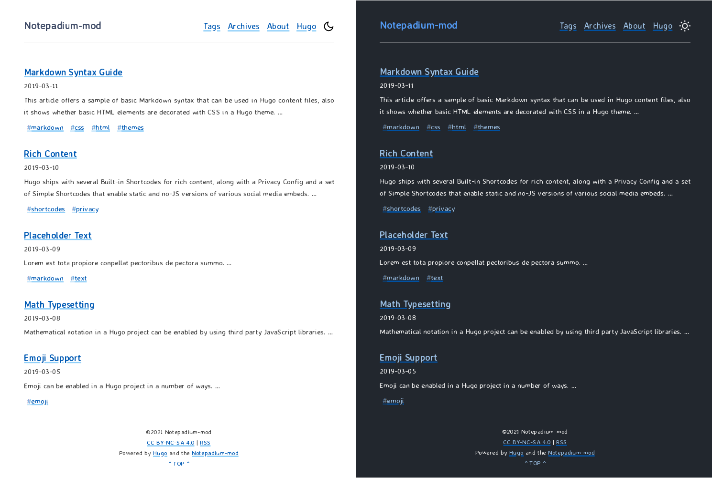

# hugo-notepadium-mod 

 [](https://app.netlify.com/sites/distracted-mirzakhani-1980a4/deploys)

[English](./README.md) | [中文](./README.zh-CN.md) | [✨**Live demo**](https://theme-notemod.littlezhang.com/) | [✨littlezhang's blog](https://www.littlezhang.com)

快速简单的 [Hugo](https://gohugo.io) 主题，**100％不含JavaScript**.



<!-- vim-markdown-toc GFM -->

* [介绍](#介绍)
* [特色功能](#特色功能)
  * [与原始的notepadium主题不同：](#与原始的notepadium主题不同)
  * [其它功能](#其它功能)
* [开始使用](#开始使用)
  * [选项1](#选项1)
  * [选项2](#选项2)
* [配置主题](#配置主题)
* [更新主题](#更新主题)
* [自定义主题](#自定义主题)
* [Thanks](#thanks)

<!-- vim-markdown-toc -->

## 介绍

这个 Hugo 主题派生自[早期版本](https://github.com/cntrump/hugo-notepadium/releases/tag/v2.1.0)的[hugo-notepadium](https://github.com/cntrump/hugo-notepadium).

**[WIP]该项目和文档仍在进行中！如有任何问题，可以与我联系。**

要求 Hugo 版本：[0.68.0+](https://github.com/gohugoio/hugo/releases/)

## 特色功能

### 与原始的notepadium主题不同：

-   网格(grid)布局 （[我可以使用 grid 吗？](https://caniuse.com/?search=grid))
-   标签云
-   目录
-   预连接和预取资源
-   内联关键CSS
-   [Hugo Modules](https://gohugo.io/categories/hugo-modules)
-   存档页面
-   浅色和深色主题切换按钮
-   在网站中搜索（功能提供：[stork](https://github.com/jameslittle230/stork))[如何使用它？](<>)

### 其它功能

-   LOGO
-   导航栏
-   语法高亮
-   数学支持
-   分页，支持大量页面
-   黑暗模式
-   自定义CSS支持
-   自定义JS支持
-   自定义 header

## 开始使用

对于Hugo网站，有两种方法可以使用此主题。

### 选项1

使用 Hugo 模块。 Hugo Modules 由 Go Modules 驱动。如果您已经安装[Go](https://golang.org/)，此选项是**推荐的**。可以在以下找到更多详细信息[Hugo 文档](https://gohugo.io/hugo-modules/use-modules/)

1.  在您的网站根目录中初始化hugo模块系统：

```bash
hugo mod init github.com/<your_user>/<your_project>
```

2.  将主题导入到config.toml中：

```toml
[module]
  [[module.imports]]
    path = "github.com/qdzhang/hugo-notepadium-mod"
```

### 选项2

使用git子模块。

1.  将主题存储库添加为git子模块

```bash
git submodule add https://https://github.com/qdzhang/hugo-notepadium-mod.git themes/hugo-notepadium-mod
```

2.  在您的config.toml中设置主题

```toml
theme = "hugo-notepadium-mod"
```

## 配置主题

几乎所有内容都可以在`config.toml`您网站的文件。如果要修改主题，可以转到[自定义主题](#customize-theme)

有一个例子`config.toml`:

```toml

baseURL = "https://www.example.com/"
title = "Hugo-notepadium-mod"
copyright = "©2021 hugo-notepadium-mod"

languageCode = "zh-cn"
hasCJKLanguage = true
defaultContentLanguage = "zh-cn"

enableRobotsTXT = true
paginate = 7  # The number of articles in per page
enableEmoji = true

# Enable Disqus
#disqusShortname = "XXX"

# Google Analytics
#googleAnalytics = "UA-123-45"


[module]
  [[module.imports]]
    path = "github.com/qdzhang/hugo-notepadium-mod"  # Use module to use this theme

[minify]
# Deploy with --minify command to minify assets
# Need Hugo version v0.68.0+
  disableCSS = false
  disableHTML = false
  disableJS = false
  disableJSON = false
  disableSVG = false
  disableXML = false
  minifyOutput = true
  [minify.tdewolff]
    [minify.tdewolff.css]
      keepCSS2 = true
      precision = 1
    [minify.tdewolff.html]
      keepComments = false
      keepConditionalComments = true
      keepDefaultAttrVals = true
      keepDocumentTags = true
      keepEndTags = true
      keepQuotes = false
      keepWhitespace = false
    [minify.tdewolff.js]
      keepVarNames = false
      precision = 1
    [minify.tdewolff.json]
      precision = 0
    [minify.tdewolff.svg]
      precision = 1
    [minify.tdewolff.xml]
      keepWhitespace = false

# Configure chroma highlight
# Reference https://gohugo.io/content-management/syntax-highlighting/
# https://gohugo.io/getting-started/configuration-markup#highlight
[markup.highlight]
codeFences = true
guessSyntax = true
noClasses = true
style = "dracula"

[markup.goldmark.renderer]
unsafe = true  # enable raw HTML in Markdown

[markup.tableOfContents]
    endLevel = 3
    ordered = false
    startLevel = 2

[permalinks]
  post = "/:year/:month/:title/"

[author]
    name = "理头张"  # Change to your name


[params]
author = "理头张"
description = "littlezhang's blog"
style = "auto"  # default: auto. light: light theme, dark: dark theme, auto: based on system.
logo = "https://cdn.jsdelivr.net/gh/qdzhang/littlezhang.com/static/logo.png"
slogan = ""
#license = "<a rel=license href=http://creativecommons.org/licenses/by-nc-sa/4.0/></a><br />This work is licensed under a <a rel=license href=http://creativecommons.org/licenses/by-nc-sa/4.0/>Creative Commons Attribution-NonCommercial-ShareAlike 4.0 International License</a>."

# If you use custom css files, declare them here
[params.assets]
css = ["css/fonts.css", "css/custom.css"]

[params.comments]
enable = false  # En/Disable comments globally, default: false. You can always enable comments on per page.

[params.math]
enable = false # load math globally, default: false. You can always enable math on per page.
use = "katex"  # builtin: "katex", "mathjax".  default: "katex"

[params.nav]
showCategories = false       # /categories/
showTags = false             # /tags/

# You can add taxonomies in there, then link new pages in [[params.nav.custom]]
# Reference https://gohugo.io/content-management/taxonomies/
[taxonomies]
  category = "categories"
  tag = "tags"

[[params.nav.custom]]
title = "Index"
url = "/"

[[params.nav.custom]]
title = "Tags"
url = "/tags/"

[[params.nav.custom]]
title = "Archives"
url = "/archives/"

[[params.nav.custom]]
title = "About"
url = "/about/"
```

## 更新主题

如果您通过Hugo模块安装了主题

```bash
hugo mod get -u  # This will update all modules
hugo mod get -u github.com/qdzhang/hugo-notepadium-mod  # This will update current theme
```

如果您通过git子模块安装了主题

```bash
git pull
```

## 自定义主题

## Thanks

- [**Hugo**](https://gohugo.io/)
- [**hugo-notepadium**](https://github.com/cntrump/hugo-notepadium)
- [**MathJax**](https://www.mathjax.org/)
- [**Katex**](https://katex.org/)
- [**stork**](https://github.com/jameslittle230/stork)
- Some minimal designs inspired by [**Kev Quirk**](https://kevq.uk/) 
